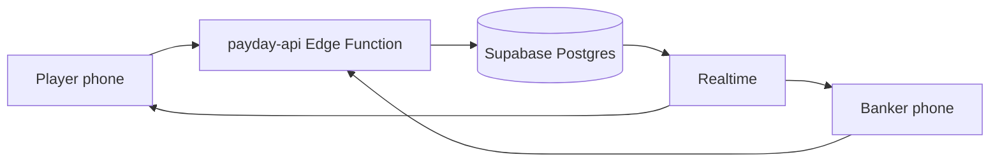

# Payday Bank (Multiplayer)

Single-file-style browser app for **Modern Payday** — now with **multiplayer**: each player joins on their phone and controls their own card. One player hosts as **banker** (Payday, lottery, jackpot, undo).

## Quick Start

1. Open `index.html` in a browser (or deploy to GitHub Pages / Netlify).
2. **Banker:** Create Game → configure players → share room code / QR link.
3. **Players:** Join Game (or open the shared link) → enter name → **Claim** your player slot.
4. **Banker:** Start Game when everyone is connected.
5. Play! Actions sync in real time via Supabase.

## Hosting

The app needs a **URL every phone can open** (not `file://`). Options:

- **GitHub Pages:** push repo, enable Pages on `main`, open `https://<user>.github.io/<repo>/`
- **Netlify / Vercel:** drag-and-drop or connect repo, publish root directory

Supabase credentials are in [`js/config.js`](js/config.js). For your own project, replace `SUPABASE_URL` and `SUPABASE_ANON_KEY`.

## Architecture

| Layer | Role |
|-------|------|
| [`index.html`](index.html) | UI shell, styles |
| [`js/app.js`](js/app.js) | Modals, rendering, role-based views |
| [`js/game-engine.js`](js/game-engine.js) | Payday rules (shared with server) |
| [`js/multiplayer.js`](js/multiplayer.js) | Supabase client, Realtime, API calls |
| [`supabase/functions/payday-api`](supabase/functions/payday-api) | Edge Function: sessions, permissions, state updates |
| Supabase DB | `games`, `game_sessions`, `game_actions` |



## Roles

| Action | Player (own card) | Banker |
|--------|-------------------|--------|
| Receive / Pay / Transfer / Loan | Yes | Yes (any player) |
| Add Bill / View Bills / Jackpot | Yes | Yes |
| **Payday** | No | Yes |
| Lottery / Rolled a 6 / Edit Jackpot | No | Yes |
| Undo / Reset | No | Yes |
| Leaderboard / History / Stats | Read-only | Full |

## Supabase Setup (already configured)

This project uses a Supabase project with:

- Tables: `games`, `game_sessions`, `game_actions`
- Edge Function: `payday-api` (`verify_jwt: false`, session-token auth)
- Realtime enabled on `games` and `game_sessions`

To redeploy the Edge Function after changes:

```bash
node scripts/bundle-edge.js
node scripts/prepare-deploy.js
# Deploy deploy-bundle.json via Supabase MCP or CLI
```

Rebuild shared engine for Deno:

```bash
node scripts/build-engine-ts.js
node scripts/bundle-edge.js
```

## Local development

Serve the folder over HTTP (required for ES modules and Supabase):

```bash
npx serve .
# or: python -m http.server 8080
```

Open `http://localhost:3000` (or your port).

## Modern Payday rules

- Starting cash: **$3,500**
- Loan interest: **10%** on Pay Day
- Loans / repayments: **$1,000** increments
- Loan repayment: **Pay Day only** (banker)
- All bills paid on Pay Day
- Jackpot: player contributions; win by rolling a 6
- Lottery: bank $1,000 + optional $100 player antes

## License

Personal / family companion for the Payday board game. Not affiliated with the game publisher.
